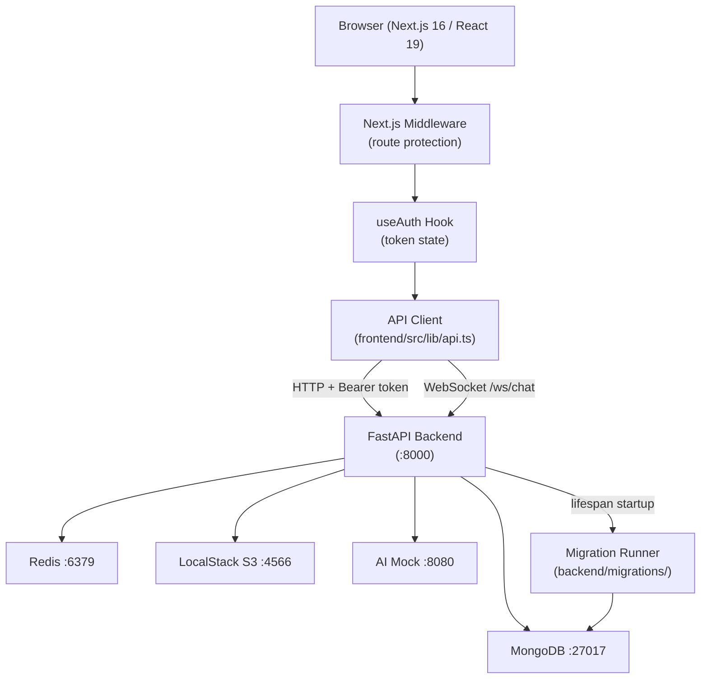

# Design Document: Trop-Med Fullstack Polish

## Overview

This document describes the technical design for bringing the Trop-Med clinical platform to production readiness. The platform consists of a FastAPI backend (`backend/`) and a Next.js 16 / React 19 frontend (`frontend/`). The work spans six areas: a Tailwind CSS design system, a wired authentication flow with token refresh and route protection, a typed API client, a versioned MongoDB migration runner, comprehensive test coverage, and complete documentation.

The existing codebase already has functional backend routes (auth, patients, clinical, AI, files, surveillance, notifications, GDPR, chat) and basic frontend pages (login, dashboard, patients, chat) using raw inline styles. This polish layer adds the production-grade infrastructure on top without rewriting core business logic.

---

## Architecture



### Request Lifecycle

1. Browser navigates to a protected route.
2. Next.js Middleware reads the `token` cookie; if absent or invalid, redirects to `/{locale}/login`.
3. Page component calls the API Client, which attaches `Authorization: Bearer <token>`.
4. On HTTP 401, the API Client intercepts, calls `/auth/refresh`, stores new tokens, and retries.
5. If refresh fails, tokens are cleared and the user is redirected to login.

### Docker Compose Topology

All services run in a single Docker Compose network (`docker/docker-compose.yml`). The frontend container uses `NEXT_PUBLIC_API_URL=http://localhost:8000/api/v1` for client-side fetches and `API_URL=http://backend:8000/api/v1` for server-side Next.js requests.

---

## Components and Interfaces

### 1. Design System

**Location:** `frontend/src/components/ui/`

| Component | Key Props | Notes |
|-----------|-----------|-------|
| `Button` | `variant`, `size`, `loading`, `disabled` | Shows `Spinner` when `loading=true` |
| `Input` | `label`, `error`, `type`, HTML attrs | Renders accessible label + error text |
| `Card` | `children`, `className` | Rounded, shadowed container |
| `Spinner` | `size` | SVG animate-spin |
| `Badge` | `role` | Colour-coded by role |
| `Table` | `columns`, `data`, `loading`, `emptySlot` | Sortable headers, skeleton, card layout <640px |
| `Modal` | `open`, `onClose`, `children` | Focus-trap via `focus-trap-react` |
| `Shell` | `children` | Sidebar + header; hamburger <768px |

**Tailwind config** (`frontend/tailwind.config.ts`):
```ts
tropmed: {
  primary: { DEFAULT: '#0d9488', ... },   // teal-600
  neutral: { DEFAULT: '#64748b', ... },   // slate-500
  danger:  { DEFAULT: '#dc2626', ... },   // red-600
  warning: { DEFAULT: '#d97706', ... },   // amber-600
}
```

### 2. Authentication Flow

**`frontend/src/hooks/useAuth.ts`** — extended to:
- Expose `refresh()` method (callable externally; also used internally by the API Client).
- Proactively refresh when token is within 60 s of expiry (checked on each API call).
- Store tokens in `localStorage` and mirror the access token to a `token` cookie for Middleware.

**`frontend/src/middleware.ts`** — rewritten to:
- Decode the `token` cookie (JWT, no network call).
- Allow public paths: `/login`, `/register`, `/_next`, `/api`, `/favicon.ico`, `/health`.
- Redirect to `/{locale}/forbidden` when role is insufficient.
- Append `?next=<original-url>` on login redirect.

**`frontend/src/lib/api.ts`** — rewritten to:
- Export typed namespace functions: `authApi`, `patientsApi`, `clinicalApi`, `aiApi`, `filesApi`, `surveillanceApi`, `notificationsApi`, `gdprApi`.
- Attach `Authorization` header from `AuthContext`.
- Throw typed `ApiError(status, code, message)` on non-2xx.
- Implement a refresh-queue: a single in-flight refresh promise shared across concurrent 401 retries.
- Accept `AbortController` signal on GET requests.
- Export `createChatSocket(token)` returning a typed `WebSocket`.

```ts
// ApiError shape
class ApiError extends Error {
  constructor(
    public status: number,
    public code: string,
    public message: string
  ) { super(message); }
}
```

### 3. Migration Runner

**Location:** `backend/migrations/`

```
backend/migrations/
  __init__.py
  runner.py          # CLI entry point
  0001_initial_indexes.py
  0002_add_audit_ttl.py
```

`runner.py` interface:
```python
async def run_migrations(db: AsyncIOMotorDatabase) -> None: ...
# CLI: python -m backend.migrations.runner
```

Each migration module must export:
```python
VERSION: int
NAME: str
async def up(db: AsyncIOMotorDatabase) -> None: ...
```

### 4. Backend Documentation Annotations

Every router endpoint gains `summary`, `description`, and `response_model`. An export script at `backend/app/scripts/export_openapi.py` writes `docs/api/openapi.json`.

### 5. Documentation Files

| File | Content |
|------|---------|
| `README.md` | Overview, architecture diagram, prerequisites, setup, env vars, test commands, migration instructions |
| `docs/architecture.md` | Component diagram, auth sequence, WebSocket flow |
| `docs/deployment.md` | Docker Compose, env vars, production considerations |
| `docs/api/openapi.json` | Generated OpenAPI schema |

### 6. Local Development Environment

**Entry points:**
- `start.sh` (Unix/macOS) and `start.bat` (Windows) at the repo root — both `cd docker/ && docker compose --env-file .env up`.
- `docker/docker-compose.yml` defines all six services: `backend`, `frontend`, `mongodb`, `redis`, `localstack`, `ai-mock`.
- `docker/.env` is bootstrapped from `backend/.env.example` with Docker-internal hostnames (`mongodb`, `redis`, `localstack`, `ai-mock`) pre-filled.

**Service configuration:**

| Service | Dev flag | Effect |
|---------|----------|--------|
| `backend` | `uvicorn --reload` | Python changes reflected without container restart |
| `frontend` | `next dev` | HMR on TypeScript/CSS changes |

**First-boot seed:** On startup, the Backend lifespan checks whether the `_migrations` collection is empty. If so, it runs `python -m app.scripts.seed` after migrations to create a default admin user, making the app immediately usable on a clean clone.

**Environment variable validation:** `pydantic-settings` validates all required vars at startup. Missing vars cause a descriptive log message and non-zero exit — surfaced immediately in `docker compose up` output.

**WebSocket URL:** `NEXT_PUBLIC_WS_URL=ws://localhost:8000/ws` is set in the frontend service so browser WebSocket connections resolve correctly outside the Docker network.

---

## Data Models

### Migration Record (`_migrations` collection)

```python
class MigrationRecord(TypedDict):
    version: int       # e.g. 1
    name: str          # e.g. "initial_indexes"
    applied_at: datetime
```

### ApiError (TypeScript)

```ts
interface ApiErrorPayload {
  status: number;   // HTTP status code
  code: string;     // machine-readable error code from backend
  message: string;  // human-readable message
}
```

### AuthContext (TypeScript)

```ts
interface AuthContextValue {
  token: string | null;
  refreshToken: string | null;
  user: { sub: string; role: Role; locale: string; exp: number } | null;
  login(email: string, password: string): Promise<LoginResult>;
  logout(): void;
  refresh(): Promise<void>;
  isAuthenticated: boolean;
}

type LoginResult =
  | { type: 'success' }
  | { type: 'mfa_required'; userId: string };
```

### Role (TypeScript)

```ts
type Role = 'admin' | 'doctor' | 'nurse' | 'researcher' | 'patient';
```

### Route Permission Map (Middleware)

```ts
const ROLE_ROUTES: Record<string, Role[]> = {
  '/[locale]/patients':     ['admin', 'doctor', 'nurse'],
  '/[locale]/surveillance': ['admin', 'doctor', 'researcher'],
  '/[locale]/settings':     ['admin'],
  // chat and notifications are accessible to all authenticated roles (no role restriction)
  '/[locale]/chat':          ['admin', 'doctor', 'nurse', 'researcher', 'patient'],
  '/[locale]/notifications': ['admin', 'doctor', 'nurse', 'researcher', 'patient'],
};
```

---

## Correctness Properties

*A property is a characteristic or behavior that should hold true across all valid executions of a system — essentially, a formal statement about what the system should do. Properties serve as the bridge between human-readable specifications and machine-verifiable correctness guarantees.*

### Property 1: Button loading prop renders Spinner

*For any* Button component, when the `loading` prop is `true`, the rendered output should contain a Spinner element and the button's primary action content should not be visible.

**Validates: Requirements 2.1, 2.8**

---

### Property 2: Badge renders a colour class for every valid Role

*For any* value in the Role enum (`admin`, `doctor`, `nurse`, `researcher`, `patient`), rendering a `Badge` with that role should produce an element with a non-empty, role-specific CSS class.

**Validates: Requirements 2.5**

---

### Property 3: Table renders correct state for all data/loading combinations

*For any* combination of `loading` (true/false), `data` (empty array / non-empty array), and `emptySlot` content, the Table component should render exactly one of: loading skeleton, empty-state slot, or data rows — never more than one simultaneously.

**Validates: Requirements 2.6**

---

### Property 4: All next/image usages have required accessibility attributes

*For any* `<Image>` component rendered in the frontend, the rendered `` element should have non-empty `alt`, explicit `width`, and explicit `height` attributes.

**Validates: Requirements 4.3, 4.4**

---

### Property 5: Successful login stores tokens and redirects

*For any* valid credential pair, calling `useAuth().login(email, password)` should result in both `token` and `refresh_token` being stored in `localStorage` and the `token` cookie being set, and the router should navigate to `/{locale}/dashboard`.

**Validates: Requirements 5.2**

---

### Property 6: HTTP 401 responses trigger token refresh and request retry

*For any* API request that receives a 401 response, the API Client should call the refresh endpoint exactly once, store the new tokens, and then replay the original request with the new access token — returning the eventual successful response to the caller.

**Validates: Requirements 6.1, 6.2**

---

### Property 7: Concurrent 401 responses trigger only one refresh call

*For any* number of concurrent API requests that all receive 401 responses simultaneously, the API Client should issue exactly one refresh call (not N refresh calls), and all N original requests should be replayed and resolved after the single refresh completes.

**Validates: Requirements 6.4**

---

### Property 8: Middleware gates protected routes based on token presence

*For any* request to a protected route, the middleware should allow the request through if and only if a valid, non-expired JWT token is present in the `token` cookie.

**Validates: Requirements 7.1, 7.2**

---

### Property 9: Public paths bypass middleware authentication check

*For any* request to a public path (`/login`, `/register`, `/_next/*`, `/api/*`, `/favicon.ico`, `/health`), the middleware should allow the request through regardless of whether a token is present.

**Validates: Requirements 7.3**

---

### Property 10: Insufficient role redirects to forbidden page

*For any* request to a role-restricted route with a valid token whose role is not in the allowed set for that route, the middleware should redirect to `/{locale}/forbidden`.

**Validates: Requirements 7.4**

---

### Property 11: API Client attaches Authorization header to authenticated requests

*For any* API call made while a token is stored in the auth context, the outgoing HTTP request should include an `Authorization: Bearer <token>` header with the current access token value.

**Validates: Requirements 8.2**

---

### Property 12: Non-2xx responses throw a typed ApiError

*For any* HTTP response with a status code outside the 2xx range, the API Client should throw an `ApiError` instance whose `status` field matches the response status code, and whose `code` and `message` fields are populated from the response body.

**Validates: Requirements 8.3**

---

### Property 13: Loading state is shown during in-flight API requests

*For any* page component that fetches data, while the fetch promise is pending, the component should render a Spinner or skeleton loading indicator in the relevant UI region.

**Validates: Requirements 9.1**

---

### Property 14: Error message is shown on API failure

*For any* API call that throws an `ApiError`, the component should display a localised error message using the `common.error` i18n key (or `common.networkError` for network-level failures).

**Validates: Requirements 9.2, 9.4**

---

### Property 15: Migration runner writes correct records to _migrations

*For any* migration that is successfully applied, the `_migrations` collection should contain exactly one document for that migration with `version` (integer), `name` (string), and `applied_at` (datetime) fields all populated.

**Validates: Requirements 11.2**

---

### Property 16: Migration runner is idempotent

*For any* set of already-applied migration versions stored in `_migrations`, running the migration runner again should apply only the migrations whose versions are absent from the collection, leaving previously-applied records unchanged and applying new ones in ascending version order.

**Validates: Requirements 11.3**

---

## Error Handling

### Frontend

**ApiError** — thrown by the API Client for all non-2xx responses. Components catch this and display localised messages via `next-intl`. The `code` field maps to i18n keys (e.g., `errors.INVALID_CREDENTIALS`, `errors.FORBIDDEN`).

**Network errors** — `fetch` rejections (no response) are caught separately and display `common.networkError` with a retry button.

**Error Boundaries** — each page is wrapped in a React `ErrorBoundary` component. On unhandled render errors, it displays a fallback UI with a "Reload" button that calls `window.location.reload()`.

**Token refresh failure** — when `/auth/refresh` returns 401 or the refresh token is missing, the API Client clears `localStorage` and the `token` cookie, then redirects to `/{locale}/login`.

**MFA flow** — the login page handles a `{ type: 'mfa_required', userId }` result from `useAuth().login()` by rendering the TOTP input step. An invalid TOTP code displays `auth.invalidMfaCode`.

### Backend

**AppError** — existing typed error class with `status` and `code`. All route handlers raise `AppError` or `HTTPException`; the global handlers in `core/errors.py` format them as `{ "error": { "code": "...", "message": "..." } }`.

**Migration failures** — if a migration's `up()` function raises any exception, the runner catches it, logs the full traceback, and does **not** insert a record into `_migrations`. Subsequent migrations are not attempted.

**Missing environment variables** — `pydantic-settings` raises a `ValidationError` at startup if required fields are absent. The lifespan handler catches this, logs the missing field names, and re-raises to exit with a non-zero status.

**Rate limiting** — the existing `RateLimitMiddleware` returns HTTP 429 with a `Retry-After` header. The API Client treats 429 as a non-retryable `ApiError`.

---

## Testing Strategy

### Backend (Python / pytest)

**Framework:** `pytest` with `pytest-asyncio` (already configured in `pyproject.toml`), `httpx.AsyncClient` for route tests, `unittest.mock` for service mocking.

**Property-based testing library:** `hypothesis` — add to `requirements.txt` as a dev dependency.

**Unit tests** (`backend/tests/`):
- Auth endpoints: register, login (valid/invalid/inactive), refresh (valid/expired), logout, MFA setup, MFA verify (valid/invalid code).
- Patient CRUD: create, list with search, get by ID (found/not found), update, delete (admin allowed, nurse forbidden).
- Role-based access: each Role against `/patients`, `/clinical`, `/ai/differential`, `/surveillance`, `/gdpr`.
- AI endpoints: query (high/low confidence), differential (doctor allowed, patient forbidden), literature search.
- Migration runner: record written on success, collection unchanged on failure, idempotency.

**Property tests** (`backend/tests/test_properties.py`):
- Property 15: `@given(migration_strategy())` — for any migration, after `up()` succeeds, `_migrations` contains a document with correct `version`, `name`, `applied_at` fields.
- Property 16: `@given(st.sets(st.integers(min_value=1, max_value=100)))` — for any set of pre-applied versions, running the runner applies only the missing ones in order.

**Coverage target:** ≥ 80% line coverage across `app/api/routes/` and `app/services/`. Run with `pytest --cov=app --cov-report=term-missing`. Coverage is enforced locally — a `pytest --cov=app --cov-fail-under=80` flag will exit non-zero if the threshold is not met, making it suitable as a CI gate.

**Tag format for property tests:**
```python
# Feature: trop-med-fullstack-polish, Property 15: migration records written correctly
# Feature: trop-med-fullstack-polish, Property 16: migration runner is idempotent
```

**Run command:** `pytest` from `backend/` directory.

---

### Frontend (TypeScript / Vitest)

**Framework:** `vitest` + `@testing-library/react` + `@testing-library/user-event`. Add to `devDependencies`.

**Property-based testing library:** `fast-check` — add to `devDependencies`.

**Unit tests** (`frontend/src/__tests__/`):
- `Button`: renders with each `variant`/`size` combination, shows Spinner when `loading=true`, is disabled when `disabled=true`.
- `Input`: renders label, renders error text, forwards HTML attributes.
- `Card`: renders children inside container.
- `Table`: renders loading skeleton, empty state, data rows.
- `Badge`: renders correct class for each Role.
- `Modal`: renders close button with `aria-label`, traps focus.
- Login flow integration: successful login → redirect, failed login → error message, MFA step renders.
- API Client token-refresh interceptor: 401 → refresh → retry.
- Middleware: unauthenticated → redirect to login with `?next=`, authenticated → pass through, insufficient role → forbidden.

**Property tests** (`frontend/src/__tests__/properties.test.ts`):

```ts
// Feature: trop-med-fullstack-polish, Property 1: Button loading prop renders Spinner
fc.assert(fc.property(fc.boolean(), (loading) => { ... }), { numRuns: 100 });

// Feature: trop-med-fullstack-polish, Property 2: Badge renders colour for every Role
fc.assert(fc.property(fc.constantFrom(...roles), (role) => { ... }), { numRuns: 100 });

// Feature: trop-med-fullstack-polish, Property 3: Table renders correct state
fc.assert(fc.property(fc.boolean(), fc.array(fc.record({...})), (loading, data) => { ... }), { numRuns: 100 });

// Feature: trop-med-fullstack-polish, Property 4: next/image has required accessibility attributes
fc.assert(fc.property(fc.string(), fc.integer({min:1}), fc.integer({min:1}), (alt, w, h) => { ... }), { numRuns: 100 });

// Feature: trop-med-fullstack-polish, Property 5: successful login stores tokens and redirects
fc.assert(fc.property(fc.emailAddress(), fc.string({minLength:8}), (email, password) => { ... }), { numRuns: 100 });

// Feature: trop-med-fullstack-polish, Property 6: 401 triggers refresh and retry
fc.assert(fc.property(fc.string(), fc.string(), (path, body) => { ... }), { numRuns: 100 });

// Feature: trop-med-fullstack-polish, Property 7: concurrent 401s trigger one refresh
fc.assert(fc.property(fc.integer({min:2, max:10}), (n) => { ... }), { numRuns: 100 });

// Feature: trop-med-fullstack-polish, Property 8: middleware gates protected routes
fc.assert(fc.property(protectedRouteArb, tokenArb, (route, token) => { ... }), { numRuns: 100 });

// Feature: trop-med-fullstack-polish, Property 9: public paths bypass auth
fc.assert(fc.property(fc.constantFrom(...publicPaths), (path) => { ... }), { numRuns: 100 });

// Feature: trop-med-fullstack-polish, Property 10: insufficient role → forbidden
fc.assert(fc.property(roleArb, routeArb, (role, route) => { ... }), { numRuns: 100 });

// Feature: trop-med-fullstack-polish, Property 11: Authorization header attached
fc.assert(fc.property(fc.string(), fc.string(), (path, token) => { ... }), { numRuns: 100 });

// Feature: trop-med-fullstack-polish, Property 12: non-2xx throws ApiError
fc.assert(fc.property(fc.integer({min:400, max:599}), (status) => { ... }), { numRuns: 100 });
```

Each property test runs a minimum of 100 iterations (`numRuns: 100`).

**Run command:** `vitest --run` from `frontend/` directory.

---

### Dual Testing Rationale

Unit tests catch concrete bugs in specific scenarios (e.g., the exact MFA flow, the exact empty-state message). Property tests verify universal invariants across the full input space (e.g., that *any* 401 triggers refresh, not just a specific URL). Both are required for comprehensive coverage.
