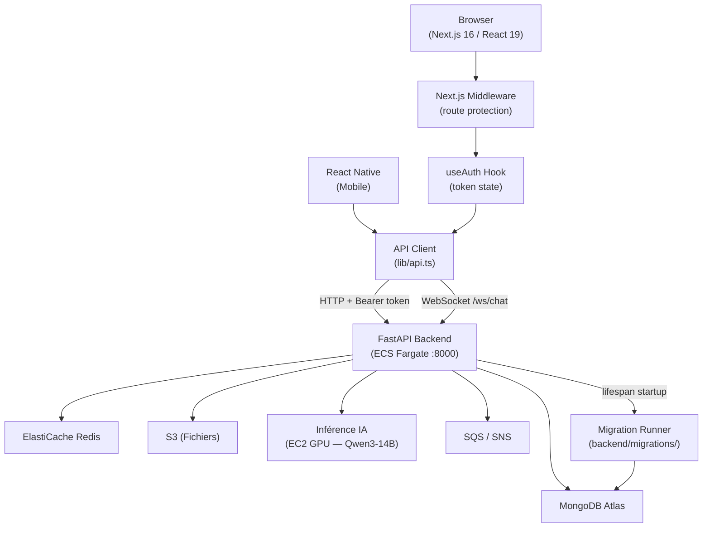

# Trop-Med

> Plateforme de médecine tropicale alimentée par l'IA pour le suivi des patients, la surveillance épidémiologique et l'aide à la décision clinique.

Trop-Med est destinée aux professionnels de santé et aux patients dans des environnements multilingues (français/anglais) à faible connectivité, avec un focus principal sur le Togo et les contextes similaires.

---

## Capacités principales

| Capacité | Description |
|---|---|
| Questions-réponses médicales | Réponses fondées sur des preuves avec indication du niveau d'incertitude |
| Aide à la décision clinique | Diagnostic différentiel, évaluation des traitements, application des protocoles |
| Revue de littérature scientifique | Synthèse d'articles médicaux, extraction des résultats clés |
| Communication patient | Concepts médicaux complexes traduits en langage accessible |
| Chatbot multilingue | Interface conversationnelle français/anglais pour patients et soignants |
| Suivi des patients | Enregistrement, historique des visites, plans de traitement, résultats |
| Surveillance épidémiologique | Tableaux de bord, détection d'épidémies, analyse des tendances |

---

## Architecture



Voir [`docs/architecture.md`](docs/architecture.md) pour les diagrammes de séquence et de composants détaillés.

---

## Rôles et accès

| Rôle | Niveau d'accès |
|---|---|
| Administrateur | Configuration complète, gestion des utilisateurs, journaux d'audit |
| Médecin | Fonctionnalités cliniques complètes, assistant IA, prescriptions |
| Infirmier(ère) | Accueil des patients, signes vitaux, triage, accès IA limité |
| Chercheur | Données anonymisées, revue de littérature, tableaux de bord de surveillance |
| Patient | Ses propres dossiers, chatbot, prise de rendez-vous, notifications |

---

## Stack technique

| Couche | Technologie |
|---|---|
| Frontend | Next.js 16 / React 19, TypeScript, Tailwind CSS |
| Mobile | React Native (partage de code avec le web) |
| API Backend | Python, FastAPI |
| IA / LLM | MedicalQwen3-Reasoning-14B sur EC2 GPU (g5.2xlarge) |
| Base de données | MongoDB Atlas (standard FHIR R4) |
| Temps réel | WebSockets (chat, notifications) |
| Stockage de fichiers | AWS S3 |
| Infrastructure | AWS, provisionnée via Terraform |
| Développement local | Docker Compose + LocalStack |
| Conformité | HIPAA + RGPD |

---

## Prérequis

- [Docker](https://docs.docker.com/get-docker/) ≥ 24 avec Compose v2
- Git

Aucune installation locale de Python ou Node.js n'est requise pour faire tourner la stack.

Pour le développement local hors Docker :
- Python ≥ 3.12
- Node.js ≥ 20

---

## Démarrage rapide (Docker Compose)

1. Cloner le dépôt :
   ```bash
   git clone <repo-url>
   cd trop-med
   ```

2. Copier le fichier d'environnement :
   ```bash
   cp backend/.env.example docker/.env
   ```
   Les valeurs par défaut fonctionnent sans modification pour le développement local. Voir la section [Variables d'environnement](#variables-denvironnement) pour les personnaliser.

3. Démarrer tous les services :

   **Unix / macOS :**
   ```bash
   ./start.sh
   ```

   **Windows :**
   ```bat
   start.bat
   ```

   Ou directement :
   ```bash
   cd docker && docker compose --env-file .env up
   ```

4. Accéder à l'application :
   - Frontend : http://localhost:3000
   - Documentation API (Swagger) : http://localhost:8000/docs
   - ReDoc : http://localhost:8000/redoc

Au premier démarrage, le backend exécute automatiquement les migrations de base de données et insère un utilisateur administrateur par défaut. Aucune configuration manuelle n'est nécessaire.

---

## Variables d'environnement

Toutes les variables se trouvent dans `docker/.env` (initialisé depuis `backend/.env.example`).

| Variable | Défaut | Description |
|---|---|---|
| `MONGODB_URI` | `mongodb://mongodb:27017/tropmed` | Chaîne de connexion MongoDB |
| `REDIS_URL` | `redis://redis:6379` | Chaîne de connexion Redis |
| `JWT_SECRET` | `dev-secret-change-in-prod` | Clé de signature JWT — **à changer en production** |
| `AWS_S3_BUCKET` | `tropmed-files-local` | Nom du bucket S3 pour les fichiers |
| `AWS_REGION` | `us-east-1` | Région AWS |
| `AWS_ENDPOINT_URL` | `http://localstack:4566` | Endpoint LocalStack (interne Docker) |
| `AWS_ACCESS_KEY_ID` | `test` | Clé d'accès LocalStack |
| `AWS_SECRET_ACCESS_KEY` | `test` | Clé secrète LocalStack |
| `AI_INFERENCE_URL` | `http://ai-mock:8080` | URL du service d'inférence IA (interne Docker) |
| `APP_LOCALE` | `fr` | Langue par défaut de l'application (`fr` ou `en`) |
| `NEXT_PUBLIC_API_URL` | `http://localhost:8000/api/v1` | URL de l'API pour les requêtes côté navigateur |
| `API_URL` | `http://backend:8000/api/v1` | URL de l'API pour les requêtes côté serveur Next.js |
| `NEXT_PUBLIC_WS_URL` | `ws://localhost:8000/ws` | URL WebSocket pour les connexions navigateur |

---

## Exécution des tests

### Backend

```bash
cd backend
pytest
```

Avec rapport de couverture :
```bash
pytest --cov=app --cov-report=term-missing
```

Seuil de couverture à 80% (utilisé en CI) :
```bash
pytest --cov=app --cov-fail-under=80
```

### Frontend

```bash
cd frontend
vitest --run
```

---

## Migrations de base de données

Les migrations se trouvent dans `backend/migrations/` et sont appliquées automatiquement à chaque démarrage du backend. Chaque migration est un module Python numéroté (ex. `0001_initial_indexes.py`) qui exporte `VERSION`, `NAME` et une fonction async `up(db)`.

Les migrations appliquées sont enregistrées dans la collection MongoDB `_migrations`. Le runner est idempotent — les migrations déjà appliquées sont ignorées.

**Exécuter les migrations manuellement :**
```bash
cd backend
python -m backend.migrations.runner
```

**Ajouter une nouvelle migration :**
1. Créer `backend/migrations/NNNN_description.py`
2. Exporter `VERSION: int`, `NAME: str` et `async def up(db) -> None`
3. Le runner la détecte automatiquement au prochain démarrage

---

## Structure du projet

```
trop-med/
├── backend/              # Application FastAPI
│   ├── app/
│   │   ├── api/routes/   # Gestionnaires de routes
│   │   ├── services/     # Logique métier
│   │   ├── models/       # Modèles Pydantic
│   │   ├── core/         # Config, auth, erreurs, audit
│   │   └── scripts/      # Scripts seed et utilitaires
│   ├── migrations/       # Migrations MongoDB versionnées
│   └── tests/            # Suite de tests pytest
├── frontend/             # Application Next.js 16 / React 19
│   └── src/
│       ├── app/          # Pages App Router Next.js
│       ├── components/   # Composants UI partagés
│       ├── hooks/        # Hooks React (useAuth, etc.)
│       ├── lib/          # Client API, utilitaires
│       └── __tests__/    # Suite de tests Vitest
├── docker/               # Configuration Docker Compose
├── docs/                 # Documentation architecture et déploiement
│   └── specs/            # Spécifications techniques détaillées
├── start.sh              # Script de démarrage Unix
└── start.bat             # Script de démarrage Windows
```

---

## Conformité

- **HIPAA** — chiffrement des données de santé au repos et en transit, pistes d'audit, contrôle d'accès RBAC avec MFA
- **RGPD** — gestion du consentement granulaire, portabilité des données (export FHIR R4), droit à l'effacement

Toutes les réponses IA incluent un avertissement de vérification clinique. Les réponses avec un score de confiance inférieur à 0.6 déclenchent un avertissement d'incertitude explicite.

---

## Documentation

- [Architecture](docs/architecture.md) — diagramme de composants, séquence d'authentification, flux WebSocket
- [Déploiement](docs/deployment.md) — Docker Compose, variables d'environnement, considérations de production
- [Spécifications techniques](docs/specs/README.md) — vue d'ensemble, API, infrastructure, conformité, fonctionnalités
- [Référence API](http://localhost:8000/docs) — Swagger UI (nécessite le backend en cours d'exécution)
