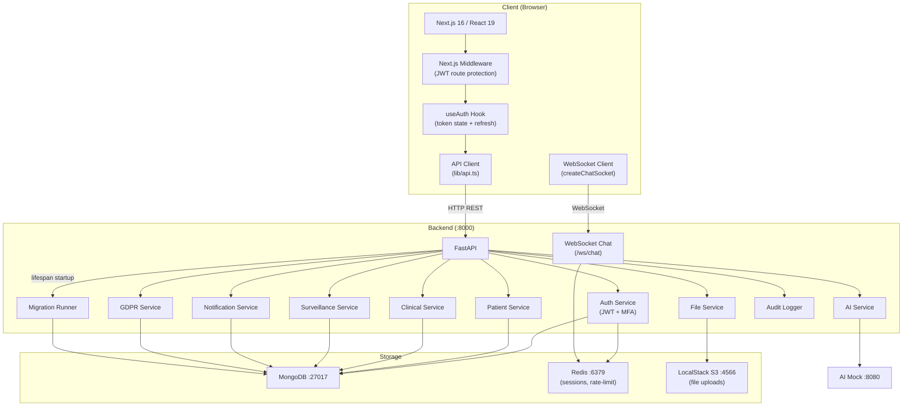
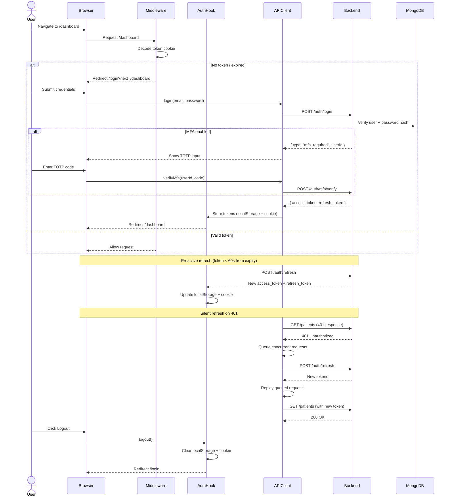
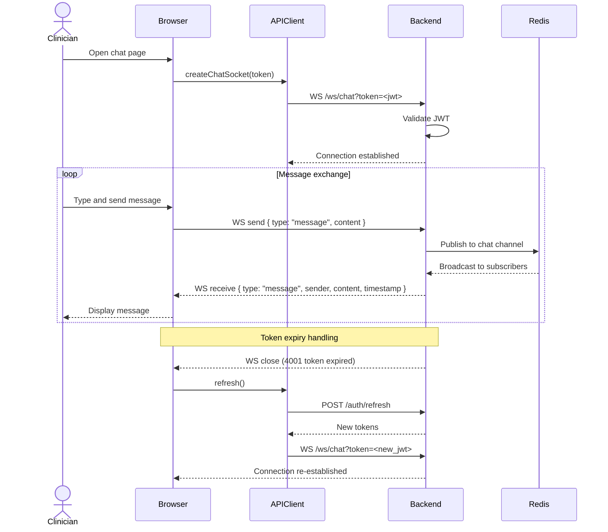
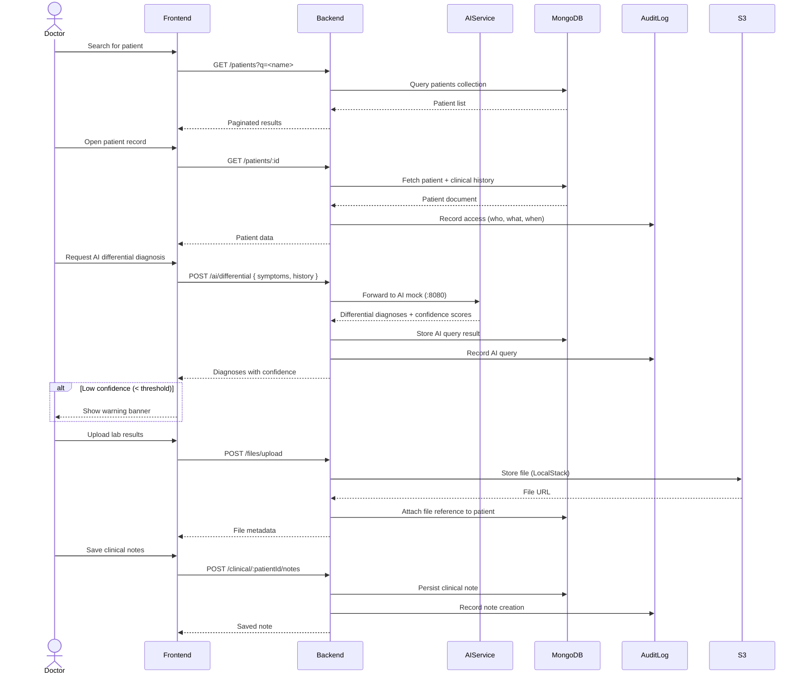

# Architecture

## Component Diagram

```mermaid
graph TD
    subgraph Client["Client (Browser)"]
        NextJS["Next.js 16 / React 19"]
        Middleware["Next.js Middleware\n(JWT route protection)"]
        AuthHook["useAuth Hook\n(token state + refresh)"]
        APIClient["API Client\n(lib/api.ts)"]
        WSClient["WebSocket Client\n(createChatSocket)"]
    end

    subgraph Backend["Backend (:8000)"]
        FastAPI["FastAPI"]
        AuthService["Auth Service\n(JWT + MFA)"]
        PatientService["Patient Service"]
        ClinicalService["Clinical Service"]
        AIService["AI Service"]
        FileService["File Service"]
        SurveillanceService["Surveillance Service"]
        NotifService["Notification Service"]
        GDPRService["GDPR Service"]
        ChatWS["WebSocket Chat\n(/ws/chat)"]
        MigRunner["Migration Runner"]
        AuditLog["Audit Logger"]
    end

    subgraph Storage["Storage"]
        MongoDB["MongoDB :27017"]
        Redis["Redis :6379\n(sessions, rate-limit)"]
        S3["LocalStack S3 :4566\n(file uploads)"]
    end

    AIMock["AI Mock :8080"]

    NextJS --> Middleware
    Middleware --> AuthHook
    AuthHook --> APIClient
    APIClient -->|"HTTP REST"| FastAPI
    WSClient -->|"WebSocket"| ChatWS

    FastAPI --> AuthService
    FastAPI --> PatientService
    FastAPI --> ClinicalService
    FastAPI --> AIService
    FastAPI --> FileService
    FastAPI --> SurveillanceService
    FastAPI --> NotifService
    FastAPI --> GDPRService
    FastAPI --> AuditLog

    AuthService --> MongoDB
    AuthService --> Redis
    PatientService --> MongoDB
    ClinicalService --> MongoDB
    AIService --> AIMock
    FileService --> S3
    SurveillanceService --> MongoDB
    NotifService --> MongoDB
    GDPRService --> MongoDB
    ChatWS --> Redis
    MigRunner --> MongoDB
    FastAPI -->|"lifespan startup"| MigRunner
```

---

## Authentication Sequence

```mermaid
sequenceDiagram
    actor User
    participant Browser
    participant Middleware
    participant AuthHook
    participant APIClient
    participant Backend
    participant MongoDB

    User->>Browser: Navigate to /dashboard
    Browser->>Middleware: Request /dashboard
    Middleware->>Middleware: Decode token cookie
    alt No token / expired
        Middleware-->>Browser: Redirect /login?next=/dashboard
        User->>Browser: Submit credentials
        Browser->>APIClient: login(email, password)
        APIClient->>Backend: POST /auth/login
        Backend->>MongoDB: Verify user + password hash
        alt MFA enabled
            Backend-->>APIClient: { type: "mfa_required", userId }
            APIClient-->>Browser: Show TOTP input
            User->>Browser: Enter TOTP code
            Browser->>APIClient: verifyMfa(userId, code)
            APIClient->>Backend: POST /auth/mfa/verify
        end
        Backend-->>APIClient: { access_token, refresh_token }
        APIClient->>AuthHook: Store tokens (localStorage + cookie)
        AuthHook-->>Browser: Redirect /dashboard
    else Valid token
        Middleware-->>Browser: Allow request
    end

    Note over Browser,Backend: Proactive refresh (token < 60s from expiry)
    AuthHook->>Backend: POST /auth/refresh
    Backend-->>AuthHook: New access_token + refresh_token
    AuthHook->>AuthHook: Update localStorage + cookie

    Note over Browser,Backend: Silent refresh on 401
    APIClient->>Backend: GET /patients (401 response)
    Backend-->>APIClient: 401 Unauthorized
    APIClient->>APIClient: Queue concurrent requests
    APIClient->>Backend: POST /auth/refresh
    Backend-->>APIClient: New tokens
    APIClient->>APIClient: Replay queued requests
    APIClient->>Backend: GET /patients (with new token)
    Backend-->>APIClient: 200 OK

    User->>Browser: Click Logout
    Browser->>AuthHook: logout()
    AuthHook->>AuthHook: Clear localStorage + cookie
    AuthHook-->>Browser: Redirect /login
```

---

## WebSocket Chat Flow

```mermaid
sequenceDiagram
    actor Clinician
    participant Browser
    participant APIClient
    participant Backend
    participant Redis

    Clinician->>Browser: Open chat page
    Browser->>APIClient: createChatSocket(token)
    APIClient->>Backend: WS /ws/chat?token=<jwt>
    Backend->>Backend: Validate JWT
    Backend-->>APIClient: Connection established

    loop Message exchange
        Clinician->>Browser: Type and send message
        Browser->>Backend: WS send { type: "message", content }
        Backend->>Redis: Publish to chat channel
        Redis-->>Backend: Broadcast to subscribers
        Backend-->>Browser: WS receive { type: "message", sender, content, timestamp }
        Browser-->>Clinician: Display message
    end

    Note over Browser,Backend: Token expiry handling
    Backend-->>Browser: WS close (4001 token expired)
    Browser->>APIClient: refresh()
    APIClient->>Backend: POST /auth/refresh
    Backend-->>APIClient: New tokens
    APIClient->>Backend: WS /ws/chat?token=<new_jwt>
    Backend-->>Browser: Connection re-established
```

---

## Data Flow: Typical Clinical Encounter

```mermaid
sequenceDiagram
    actor Doctor
    participant Frontend
    participant Backend
    participant AIService
    participant MongoDB
    participant AuditLog

    Doctor->>Frontend: Search for patient
    Frontend->>Backend: GET /patients?q=<name>
    Backend->>MongoDB: Query patients collection
    MongoDB-->>Backend: Patient list
    Backend-->>Frontend: Paginated results

    Doctor->>Frontend: Open patient record
    Frontend->>Backend: GET /patients/:id
    Backend->>MongoDB: Fetch patient + clinical history
    MongoDB-->>Backend: Patient document
    Backend->>AuditLog: Record access (who, what, when)
    Backend-->>Frontend: Patient data

    Doctor->>Frontend: Request AI differential diagnosis
    Frontend->>Backend: POST /ai/differential { symptoms, history }
    Backend->>AIService: Forward to AI mock (:8080)
    AIService-->>Backend: Differential diagnoses + confidence scores
    Backend->>MongoDB: Store AI query result
    Backend->>AuditLog: Record AI query
    Backend-->>Frontend: Diagnoses with confidence

    alt Low confidence (< threshold)
        Frontend-->>Doctor: Show warning banner
    end

    Doctor->>Frontend: Upload lab results
    Frontend->>Backend: POST /files/upload
    Backend->>S3: Store file (LocalStack)
    S3-->>Backend: File URL
    Backend->>MongoDB: Attach file reference to patient
    Backend-->>Frontend: File metadata

    Doctor->>Frontend: Save clinical notes
    Frontend->>Backend: POST /clinical/:patientId/notes
    Backend->>MongoDB: Persist clinical note
    Backend->>AuditLog: Record note creation
    Backend-->>Frontend: Saved note
```
